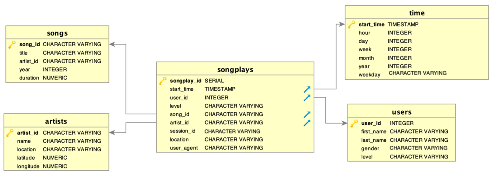

# Data Modelling With Postgres

************************************************************************************************
## README

This is the README file for the first project 'Data Modelling with Postgres' of the Udacity Data Engineering Nanodegree Program. The aim of this project is to model user activity data to create a database and ETL pipeline in Postgres for a music streamin app. There will be defined Fact and Dimension tables and insert data into new tables.

************************************************************************************************
### Purpose of this database in the context of the startup Sparkify

Sparkify is a startup and wants to analyze the data of their new music streaming app. The analytical goal is to understand what songs users like best. At the moment Sparkfify works with JSON logs. With this logs it is very difficult to query the data and perfrom analyses on user activities and on songs.

************************************************************************************************
### Database schema design and ETL process
Here you can find a Postgres database with star schema optimized for queries on song play analyses.
The benefits of the star schema are the following
- Denormalized tables
- Simplifies queries
- Fast aggregations



In order to rule out problems with the data quality in the data provided "song_play_id", a serial data type is used which adds an incremented integer value for each new line.
Also, no formal relationships have been established between the fact and dimension tables with the restrictions necessary to intercept missing foreign keys.
To maintain data integrity, foreign key relationships have been created between the fact table and the dimension table.
This means that only valid values are entered in the fact table. The order of the table creation had to be adjusted accordingly.
The data types used were serial, varchar, integer, timestamp and numeric according to the specifications.

************************************************************************************************
#### ELT design
ETL connects to the existing database. The JSON files from the song_data folder are opened and analyzed in a data frame in which relevant columns are inserted into the corresponding fields using hard-coded SQL queries. The files are also read from the log_files folder and analyzed. Non-relevant data is filtered. Time and user tables are filled accordingly. In addition, the song and artist keys are used to generate fact table songplay.

************************************************************************************************
### Files in repository

1. README.md A | README file
2. create_tables.py | Python script to drop and create the 'sparkify' database tables, as specified in 'sql_queries.py'
3. sql_queries.py | Python script containing SQL queries
4. etl.py | Python script to get the JSON data into the new database (ETL pipeline)

************************************************************************************************
### How to run the python scripts
Open a terminal or command-line and run the following two python scripts:
```sh
python create_tables.py
```
Once the command line returns, run
```sh
python elt.py
```
The console screen should display each row that is being sent to the database.

************************************************************************************************
### Examples of queries

#### How many users are male, female and how many are there in total?
```sh
SELECT
     count(case when gender='M' then 1 end) as male_cnt,
     count(case when gender='F' then 1 end) as female_cnt,
     count(*) as total_cnt
     from users
```

Output:
```sh
male, female, total
(1936, 4895, 6831)
```

#### How many male and how many female persons have free and paid users level?
```sh
SELECT
    users.gender,songplays.level, count(songplays.level)
    FROM songplays
    JOIN users ON songplays.user_id = users.user_id
    GROUP BY users.gender, songplays.level ORDER BY users.gender,songplays.level
```

Output:
```sh
('F', 'free', 601)
('F', 'paid', 4294)
('M', 'free', 639)
('M', 'paid', 1297)
```

#### Find all song titles that last longer than 300 s and order by duration.
```sh
SELECT title, duration
    FROM songs
    WHERE duration > 300
    ORDER BY duration`
```

Output:
```sh
('The Ballad Of Sleeping Beauty', 305.162)
('Tonight Will Be Alright', 307.3824)
('¿Dónde va Chichi?', 313.12934)
('A Whiter Shade Of Pale (Live @ Fillmore West)', 326.00771)
('Midnight Star', 335.51628)
('Ten Tonne', 337.68444)
('Got My Mojo Workin', 338.23302)
('Superconfidential', 338.31138)
('Do You Finally Need A Friend', 342.56934)
('Prognosis', 363.85914)
('Kutt Free (DJ Volume Remix)', 407.37914)
('Kutt Free (DJ Volume Remix)', 407.37914)
('Salt In NYC', 424.12363)
('The Emperor Falls', 484.62322)
('Floating', 491.12771)
('Sono andati? Fingevo di dormire', 511.16363)
('Sohna Nee Sohna Data', 599.24853)``
```
